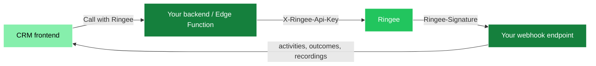

This guide is the shape of a production-grade Ringee integration: what to build, in what order, and the failure modes that bite everyone the first time.

## Architecture

The Custom Integration API key and webhook signing secret are server-side. Your frontend does not call the Public API directly. The separate Dialer SDK `pk_live_…` key is browser-safe when restricted to approved origins.



Two server-side entry points are enough:

| Component             | Responsibility                                                                                             |
| --------------------- | ---------------------------------------------------------------------------------------------------------- |
| **Outbound function** | Sends `contact.upserted` / `company.upserted` / `*.deleted` and performs click-to-call. Holds the API key. |
| **Inbound webhook**   | Receives Ringee events. Verifies the HMAC. Must be publicly reachable and must not require your own auth.  |

## Configuration and secrets

| Setting                         | Used for                                                 |
| ------------------------------- | -------------------------------------------------------- |
| `RINGEE_API_BASE_URL`           | `https://api.ringee.io`, or your self-hosted backend URL |
| `RINGEE_API_KEY`                | The `cik_live_…` key                                     |
| `RINGEE_WEBHOOK_SIGNING_SECRET` | The `whsec_…` secret used to verify incoming events      |

<Warning>
  Never expose `RINGEE_API_KEY` or `RINGEE_WEBHOOK_SIGNING_SECRET` in the
  frontend, in `localStorage`, in the repository, or in logs.
</Warning>

## Build order

<Steps>
<Step title="Receive and verify webhooks">

Start here. It is the piece most likely to be wrong, and `test.ping` gives you a tight feedback loop with no data at stake. See [Outbound webhooks](/api/outbound-webhooks#verify-the-signature).

</Step>

<Step title="Add the idempotency table">

Insert `eventId` with a `UNIQUE` constraint before processing. On conflict, return `200` and stop.

</Step>

<Step title="Map call events to activities">

Handle `call.completed`, `call.missed` and `call.failed`, keyed by `data.callId`. Then `call.outcome.updated`, `note.created`, `callback.created`, `meeting.created`, `recording.ready` and `dnc.created`.

</Step>

<Step title="Sync contacts and companies to Ringee">

Send `contact.upserted` and `company.upserted` when the relevant fields change — through an outbox, not inline with the save.

</Step>

<Step title="Add the call button">

Wire [click-to-call](/api/click-to-call), or embed the [Dialer SDK](/dialer-sdk/overview) if you want agents to stay in your UI.

</Step>

<Step title="Add the settings screen">

Expose status, the webhook URL to paste into Ringee, last sync, last error, **Test connection** and **Retry pending** — without ever showing a secret.

</Step>
</Steps>

## Matching contacts

Ringee sends `data.contact.externalId` when the record was previously linked. Resolve in this order:

1. `data.contact.externalId` — the reliable key.
2. Normalized phone number, if no `externalId` is present.
   - For **inbound** calls, match on `fromNumber`.
   - For **outbound** calls, match on `toNumber`.
3. No match: create an **unlinked activity** showing the raw phone number.

<Warning>
  Never create a duplicate contact from a call event. An unlinked activity is
  always better than a duplicate record.
</Warning>

Normalize direction for display — the wire values may be `inbound`/`incoming` or `outbound`/`outgoing`.

## Prevent sync loops

The classic failure: Ringee writes an activity → your CRM sees a row change → your CRM sends `contact.upserted` → Ringee updates the contact → repeat.

<Steps>
<Step title="Tag Ringee-written rows">

Set `sync_origin = 'ringee'` on anything a Ringee webhook created or updated.

</Step>

<Step title="Skip those rows on the way out">

Your CRM → Ringee sync must ignore:

- changes where `sync_origin = 'ringee'`;
- changes limited to call-activity fields;
- recordings;
- outcomes.

</Step>

<Step title="Sync on meaningful changes only">

Compare the fields Ringee actually uses. Do not emit an event because a timestamp or a UI-only column moved.

</Step>
</Steps>

## Outbox and retries

A contact save must never fail because Ringee is briefly unreachable. Record the event first, deliver second.

```sql
create table ringee_sync_outbox (
  id              uuid primary key default gen_random_uuid(),
  event_id        text unique not null,
  event_type      text not null,
  entity_type     text not null,
  entity_id       text not null,
  payload         jsonb not null,
  status          text not null default 'pending',
  attempt_count   int  not null default 0,
  last_error      text,
  next_attempt_at timestamptz,
  created_at      timestamptz not null default now(),
  sent_at         timestamptz
);
```

- States: `pending` → `processing` → `sent` | `failed`.
- Retry with backoff; keep `last_error` for the settings screen.
- Offer an administrative **Retry** action.
- Never send two events for the same record concurrently — you will apply them out of order.

## Multi-tenancy

If your CRM is multi-tenant, every new table needs an `organization_id` (or equivalent) and row-level security:

- users may read only their own organization's rows;
- integration settings and retry actions are limited to authorized users;
- payloads, recordings, activities and logs are never readable across organizations.

Your webhook function may use administrative database credentials — but **only after** the signature has been verified.

## Test checklist

<AccordionGroup>
<Accordion title="Signature and transport">

- Valid HMAC signature is accepted.
- Invalid signature returns `401`.
- Expired timestamp (more than 5 minutes old) is rejected.
- Body modified after signing is rejected.
- Duplicate `eventId` returns `200` and creates nothing.
- `test.ping` returns any `2xx` response.

</Accordion>

<Accordion title="Call mapping">

- Inbound completed call creates an activity on the right contact.
- Outbound completed call creates an activity on the right contact.
- Missed call is flagged as missed.
- Failed call stores the error code or message.
- Outcome received **before** `call.completed` still lands on one activity.
- Outcome received **after** `call.completed` updates, never duplicates.
- Recording received later attaches to the existing activity.

</Accordion>

<Accordion title="Sync and calling">

- Contact created or updated in Ringee from a CRM change.
- Contact archived in Ringee from a CRM delete.
- Click-to-call works for an authenticated user.
- Contact without a phone, or on DNC, cannot be called.
- No cross-organization data leaks.

</Accordion>
</AccordionGroup>

## What Ringee does not send

<Warning>
  Ringee notifies the **terminal** result of a call. There are no
  `call.started`, `call.ringing` or `call.answered` events — do not build a
  real-time incoming-call screen on top of this API. For live call state in your
  own UI, use the [Dialer SDK](/dialer-sdk/overview), which emits `dialing`,
  `ringing`, `answered` and `ended` in the browser.
</Warning>

## Next steps

<CardGroup cols={2}>
  <Card title="Logs and errors" icon="bug" href="/api/logs-and-errors">
    Debug deliveries and inbound events
  </Card>
  <Card title="Dialer SDK" icon="phone" href="/dialer-sdk/overview">
    Put the dialer inside your own UI
  </Card>
</CardGroup>
