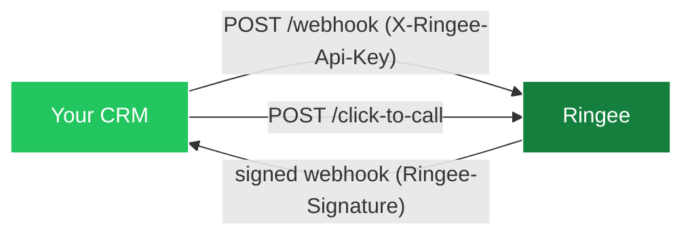

The Ringee **Public API** — exposed as **Custom Integrations** — lets any external system push its contacts and companies into Ringee, receive Ringee's call activity back, and open a secure dialer for a specific contact.

It is a **bidirectional, event-based API**. You do not poll Ringee, and Ringee does not poll you.

<CardGroup cols={2}>
  <Card title="Authentication" icon="key" href="/api/authentication">
    Create an integration and get your `cik_live_` API key
  </Card>
  <Card title="Build an integration" icon="wrench" href="/api/build-an-integration">
    End-to-end guide with idempotency, retries and loop prevention
  </Card>
</CardGroup>

## What you can do

| Capability | Direction | Endpoint |
|---|---|---|
| Create and update contacts and companies | CRM → Ringee | `POST /api/integrations/custom/webhook` |
| Archive deleted contacts and companies | CRM → Ringee | `POST /api/integrations/custom/webhook` |
| Open a secure dialer for a contact | CRM → Ringee | `POST /api/integrations/custom/click-to-call` |
| Receive completed, missed and failed calls | Ringee → CRM | Your webhook URL |
| Receive outcomes, notes, callbacks, meetings | Ringee → CRM | Your webhook URL |
| Receive recordings and Do Not Call entries | Ringee → CRM | Your webhook URL |

## How it works



- **Inbound** (CRM → Ringee): you send events to a single Ringee endpoint, authenticated with your secret API key. See [Inbound events](/api/inbound-events).
- **Outbound** (Ringee → CRM): Ringee sends HMAC-signed events to the URL you configure, with automatic retries. See [Outbound webhooks](/api/outbound-webhooks).
- **Click-to-call**: you exchange a contact for a short-lived, signed dialer URL your agent opens in the browser. See [Click-to-call](/api/click-to-call).

## The event envelope

Every event in both directions shares the same envelope:

```json
{
  "event": "contact.upserted",
  "eventId": "crm_01HX5Z7K8MZP1Q4V0G9YJ2RH3T",
  "occurredAt": "2026-05-23T14:30:00.000Z",
  "data": {}
}
```

Outbound events (Ringee → CRM) add two fields:

```json
{
  "workspaceId": "org_2k7yX...",
  "integrationId": "ci_..."
}
```

<Note>
`eventId` must be unique and stable per attempt. Both sides use it for deduplication, so retrying a failed delivery with the same `eventId` is always safe.
</Note>

## Choosing the right integration surface

Ringee exposes three different ways to build on top of it. They solve different problems and can be combined.

<CardGroup cols={3}>
  <Card title="Public API" icon="webhook" href="/api/overview">
    **Server to server.** Sync CRM records and receive call activity. Requires a backend.
  </Card>
  <Card title="Dialer SDK" icon="phone" href="/dialer-sdk/overview">
    **Browser.** Embed a real dialer in your own web app. No backend required.
  </Card>
  <Card title="MCP" icon="robot" href="/mcp/overview">
    **AI agents.** Let Claude or ChatGPT operate Ringee on the user's behalf.
  </Card>
</CardGroup>

A typical CRM integration uses **both** the Public API (to sync data and log activity) and either **click-to-call** or the **Dialer SDK** (to actually place calls from the CRM UI).

## Base URL

| Deployment | Base URL |
|---|---|
| Hosted | `https://api.ringee.io` |
| Self-hosted | Your `BACKEND_URL` (see [Configuration reference](/configuration/reference)) |

All endpoints in this section are relative to that base URL and live under the global `/api` prefix.

## Limits and expectations

- Ringee considers an outbound delivery failed if your endpoint does not respond within **15 seconds** or returns a non-2xx status.
- Failed deliveries are retried up to **10 times** with exponential backoff, capped at **5 minutes** between attempts.
- Ringee currently emits **terminal** call events only. There are no `call.started`, `call.ringing` or `call.answered` events — do not build a real-time incoming-call screen on top of this API.

## Next steps

<CardGroup cols={2}>
  <Card title="Create your API key" icon="key" href="/api/authentication">
    Set up a Custom Integration in the dashboard
  </Card>
  <Card title="Event reference" icon="list" href="/api/events-reference">
    Every outbound payload, field by field
  </Card>
</CardGroup>
