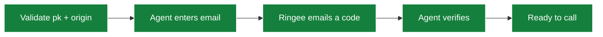

The **Ringee Dialer SDK** puts working outbound calling inside your CRM, back office or web app. Your agents never leave your product, and you never touch WebRTC, SIP credentials or a telephony provider's SDK.

```html
<script src="https://unpkg.com/@ringee/dialer-sdk"></script>
<script>
  Ringee.mount({ key: "pk_live_xxxxx" });
</script>
```

That is a complete integration: a floating launcher, agent sign-in, caller ID selection, keypad, and in-call controls.

<CardGroup cols={2}>
  <Card title="Quickstart" icon="rocket" href="/dialer-sdk/quickstart">
    From zero to a working call in a few minutes
  </Card>
  <Card title="Publishable keys" icon="key" href="/dialer-sdk/publishable-keys">
    Create a `pk_live_` key scoped to your origin
  </Card>
</CardGroup>

## Three integration modes

| Mode | Best for | Initialization | UI |
|---|---|---|---|
| [**Floating**](/dialer-sdk/floating) | Fastest path; any page | Automatic | Floating launcher + panel |
| [**Bar**](/dialer-sdk/bar) | Toolbars, sidebars, contact records | Automatic | Inline dialer |
| [**Headless**](/dialer-sdk/headless) | Fully custom design and state | Manual | None — you build it |

Start with **Floating**. Choose **Bar** when your layout already has a place for calling. Choose **Headless** only when you need control over every screen, form, state and message.

## What you get

- **No React dependency.** The bundled UIs render in an isolated Shadow DOM and work with plain JavaScript, TypeScript or any framework.
- **English and Spanish**, plus per-label copy overrides.
- **Themeable** via a theme object or CSS custom properties.
- **No provider objects.** The SDK encapsulates WebRTC and Telnyx entirely — your app never sees a SIP password or a Telnyx JWT.
- **Real Ringee calls.** Every call lands in call history, respects credits, caller ID rules and Do Not Call, and fires your [webhooks](/api/outbound-webhooks).

## How agents sign in

A publishable key identifies an *installation*, not a person. Agent identity is proven separately with a **one-time code sent by email**:



That means it is safe to ship `pk_live_…` in your frontend. It is not safe to ship the `cik_live_…` Public API key — those are different credentials. See [Publishable keys](/dialer-sdk/publishable-keys).

## Requirements

Before embedding:

- an active Ringee **Custom Integration**;
- a `pk_live_…` publishable key scoped to your exact origin;
- a Ringee agent with access to that workspace;
- at least one caller ID available to that agent or workspace;
- enough credit and permission to place calls;
- **HTTPS** in production — browsers require it for microphone access;
- a modern browser with WebRTC and `navigator.mediaDevices`.

Destination numbers must be **E.164**: `+13055550198`, `+34911234567`, `+18095550123`.

<Warning>
This is a **browser-only** package. Do not initialize it in Node.js, a React Server Component, an API route or any SSR process.
</Warning>

## Not included in this release

- There is no public Ringee URL you can drop straight into `<iframe src="…">`.
- There is no automatic `data-ringee-key` loader attribute.
- There is no separate React wrapper package — mount from `useEffect`, see [React and Next.js](/dialer-sdk/react).

You *can* run the SDK inside an iframe your own app creates, but your code must load and control the package inside that document, and the iframe needs `allow="microphone"`, an allowed origin and storage access. There is no ready-made `postMessage` bridge yet.

## Dialer SDK or click-to-call?

| | Dialer SDK | [Click-to-call](/api/click-to-call) |
|---|---|---|
| Where the call happens | Inside your app | A Ringee tab |
| Backend required | No | Yes |
| Custom UI | Yes | No |
| Live call events in your app | Yes | No |
| Setup effort | Low to medium | Very low |

Many teams start with click-to-call and move to the SDK once they want the call to live in their own interface.

## Next steps

<CardGroup cols={2}>
  <Card title="Quickstart" icon="rocket" href="/dialer-sdk/quickstart">
    Place your first call from your own page
  </Card>
  <Card title="API reference" icon="book" href="/dialer-sdk/reference">
    Options, methods, events and states
  </Card>
</CardGroup>
