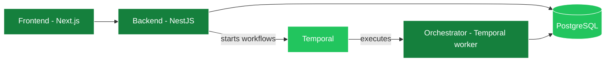

## Architecture

Ringee is composed of **3 main services** backed by a set of external services. The main services communicate through HTTP and Temporal, and connect to external services for data storage, telephony, auth, and payments.

- [Frontend](#frontend) — Web interface for managing calls, contacts, and analytics.
- [Backend](#backend) — REST API that handles all business logic and integrations.
- [Orchestrator](#orchestrator) — Temporal worker that runs durable background jobs and schedules.

### Frontend

A single **Next.js** application on port `4200`, using the App Router with feature-based organization:

- the marketing site;
- the authenticated dashboard — calls, contacts, campaigns, analytics, numbers, billing;
- the browser-based dialer, powered by Telnyx WebRTC.

It uses **Clerk** for authentication and talks to the backend API for all operations.

### Backend

The backend is the brain of Ringee — a **NestJS** application on port `3000` with a global `/api` prefix. It:

- handles REST API requests, protected by user authentication or route-specific proof such as a Custom Integration API key;
- manages Telnyx call control, number purchasing and WebRTC credentials;
- processes Stripe webhooks for payments, credits and subscriptions;
- handles Clerk webhooks for user and organization management;
- serves the [Public API](/api/overview) for CRM integrations;
- serves the [MCP server](/mcp/overview) for AI assistants;
- creates and runs [AI Voice Agents](/voice-agents/overview), including provider tools, callbacks and results;
- serves the [Dialer SDK](/dialer-sdk/overview) endpoints under `/api/v1/sdk`;
- starts durable workflows on Temporal.

### Orchestrator

A separate process (`apps/orchestrator`) that runs the **Temporal worker**. It executes the workflows the backend starts and owns the periodic schedules:

- webhook delivery drains and retries;
- callback, reminder and retry pollers;
- CRM synchronization drains;
- recording and transcription processing;
- push notifications via Firebase Cloud Messaging.

Workflow names and inputs are shared through a contracts file, so the backend and the orchestrator never drift.

<Note>
  Temporal replaced the earlier Redis pub/sub worker. Redis is still used for
  caching and session state.
</Note>

## Shared packages

Ringee is a pnpm workspaces monorepo. Business logic lives in shared packages rather than in any single app:

| Package                                    | Purpose                                                                                                     |
| ------------------------------------------ | ----------------------------------------------------------------------------------------------------------- |
| `@ringee/database`                         | Prisma client, schema and migrations                                                                        |
| `@ringee/platform`                         | Auth, Redis, email, storage, Stripe, telephony, voice-agent and AI provider adapters, notifications, crypto |
| `@ringee/services`                         | Domain services — call, contact, campaign, credit, subscription, recording, dashboard and AI Voice Agents   |
| `@ringee/configuration`                    | Centralized environment config with startup validation                                                      |
| `@ringee/frontend-shared`                  | Shared React components, hooks and utilities                                                                |
| `@ringee/dialer-core`, `@ringee/dialer-ui` | The dialer engine and UI, shared by the web app and the browser extension                                   |
| `@ringee/dialer-sdk`                       | The public browser [Dialer SDK](/dialer-sdk/overview)                                                       |
| `@ringee-io/agent`                         | Shared MCP schemas, tool catalog, prompts and safety rules for MCP, CLI and apps                            |

This is why the Public API—including AI Voice Agents—the MCP server, the CLI and the Dialer SDK preserve the same workspace and business rules: they are different entry points into the same service layer.

## External Services

| Service           | Purpose                                                     |
| ----------------- | ----------------------------------------------------------- |
| **PostgreSQL**    | Primary database via Prisma ORM                             |
| **Redis**         | Session state and caching                                   |
| **Temporal**      | Durable workflow engine for background jobs and schedules   |
| **Telnyx**        | WebRTC telephony plus the current AI Voice Agent provider   |
| **Clerk**         | Authentication and multi-tenant team management             |
| **Stripe**        | Billing, credits, subscriptions, and phone number purchases |
| **Cloudflare R2** | File storage for call recordings and media                  |
| **Resend**        | Transactional emails                                        |
| **Firebase**      | Push notifications for real-time call alerts                |

## Multi-tenancy

Users belong to organizations through memberships. Most entities — calls, contacts, numbers, credits, campaigns — carry both a `userId` and an optional `organizationId`, so a user's personal data and their organizations' data stay separate.

Every entry point respects this. The dashboard, the [Public API](/api/overview), [AI Voice Agents](/voice-agents/overview), the [MCP server](/mcp/workspaces) and the [Dialer SDK](/dialer-sdk/overview) all resolve the same ownership context before reading or writing.

## Building on Ringee

<CardGroup cols={2}>
  <Card title="Ways to build" icon="puzzle-piece" href="/build-on-ringee">
    Which integration surface fits your use case
  </Card>
  <Card title="Add a provider" icon="phone" href="/providers/add-provider">
    Integrate another telephony provider
  </Card>
</CardGroup>
