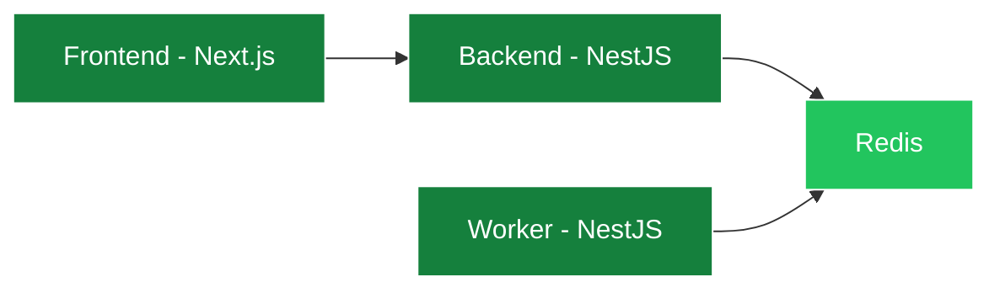

## Architecture

Ringee is composed of **3 main services** and **5 external services**. The main services communicate through HTTP, and connect to external services for data storage, telephony, auth, and payments.

- [Frontend](#frontend) — Web interface for managing calls, contacts, and analytics.
- [Backend](#backend) — REST API that handles all business logic and integrations.
- [Worker](#worker) — Background job processor for async tasks.

### Frontend

Ringee has **two Next.js frontend applications**:

- **Admin (B2B)** — Team management, analytics dashboard, phone number management, billing. Runs on port `4200`.
- **Consumer (B2C)** — Public-facing app for end users. Runs on port `4201`.

Both apps use **Clerk** for authentication and talk to the Backend API for all operations.

### Backend

The backend is the brain of Ringee — a **NestJS** application that:

- Handles all REST API requests
- Manages Telnyx WebRTC call sessions
- Processes Stripe webhooks for payments
- Handles Clerk webhooks for user/org management
- Manages contact imports, call recordings, and analytics
- Sends emails through Resend

### Worker

The worker is a separate **NestJS** process that handles background jobs:

- Call recording processing
- Bulk contact imports
- Analytics aggregation
- Push notifications via Firebase Cloud Messaging

## External Services

| Service | Purpose |
|---|---|
| **PostgreSQL** | Primary database via Prisma ORM |
| **Redis** | Session state, caching, and job queues |
| **Telnyx** | WebRTC telephony — making and receiving calls |
| **Clerk** | Authentication and multi-tenant team management |
| **Stripe** | Billing, credits, subscriptions, and phone number purchases |
| **Cloudflare R2** | File storage for call recordings and media |
| **Resend** | Transactional emails |
| **Firebase** | Push notifications for real-time call alerts |
