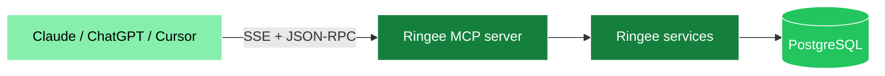

Ringee ships a built-in **MCP server**. Connect it to Claude, ChatGPT, Cursor or any MCP client and the assistant can search your contacts, review calls, prospect leads, create dialing sessions and schedule follow-ups — using your real Ringee data.

<CardGroup cols={2}>
  <Card title="Connect a client" icon="plug" href="/mcp/connect">
    Get your MCP URL and wire it into Claude or ChatGPT
  </Card>
  <Card title="Tool reference" icon="list" href="/mcp/tools">
    Every tool, its inputs and what it returns
  </Card>
</CardGroup>

## What the assistant can do

| Area | Tools |
|---|---|
| Workspaces | List available workspaces, switch between personal and organization |
| Contacts | Search, fetch details, create, update, soft-delete, find by call outcome |
| Calls | List full call history including outcome, transcription and recording URL |
| Follow-ups | Log call outcomes, schedule callbacks, book meetings |
| Call sessions | Create, inspect, update and revoke magic-link dialing queues |
| Prospecting | Search leads, reveal contact info, bulk-import as contacts (Apollo or Prospeo) |

## Architecture

The MCP server runs inside the Ringee backend. There is nothing extra to deploy.

Every tool call resolves to the same domain services the dashboard uses, so permissions, credit rules and workspace scoping behave identically no matter where the request comes from.

## Two endpoints, two auth models

| Endpoint | Auth | Use for |
|---|---|---|
| `/api/mcp/:userId/sse` | The ids embedded in the URL | Personal use — Claude Desktop, Cursor, the [`ringee` CLI](/cli/overview) |
| `/api/mcp/chatgpt/sse` | OAuth 2.1 bearer token (Clerk) | Multi-user apps — the ChatGPT connector |

<Warning>
The URL-scoped endpoint grants access to the workspace it names. Treat your MCP URL like a password: do not paste it in shared documents, tickets or screenshots.
</Warning>

## Workspace scoping

Everything an assistant reads or writes is scoped to the **active workspace** — your personal account or one organization. The assistant can move between them with `switch_workspace`, with no re-authentication. See [Workspaces](/mcp/workspaces).

## Safety model

Tools are annotated with the MCP trust hints (`readOnlyHint`, `destructiveHint`, `idempotentHint`, `openWorldHint`) so clients can warn before something consequential happens.

- **Destructive** tools — `delete_contact`, `delete_call_session` — require explicit confirmation, and `delete_contact` additionally requires the contact's stored phone number.
- **Sensitive** tools — `reveal_lead`, `create_call_session` — spend provider credits or mint shareable links.
- MCP lead tools **never spend Ringee credits**, though `search_leads` and `reveal_lead` do consume your connected enrichment provider's allowance.

See [Safety and confirmations](/mcp/safety).

## Beyond the raw protocol

<CardGroup cols={3}>
  <Card title="ringee CLI" icon="terminal" href="/cli/overview">
    Drive the same tools from a terminal or a shell-capable agent
  </Card>
  <Card title="Claude skills" icon="sparkles" href="/mcp/apps">
    `/ringee` commands in Claude Code and claude.ai
  </Card>
  <Card title="ChatGPT app" icon="comments" href="/mcp/apps">
    Visual Ringee cards inside ChatGPT
  </Card>
</CardGroup>

## Next steps

<Card title="Connect your first client" icon="plug" href="/mcp/connect">
  Get your MCP URL from the dashboard and paste it into Claude
</Card>
