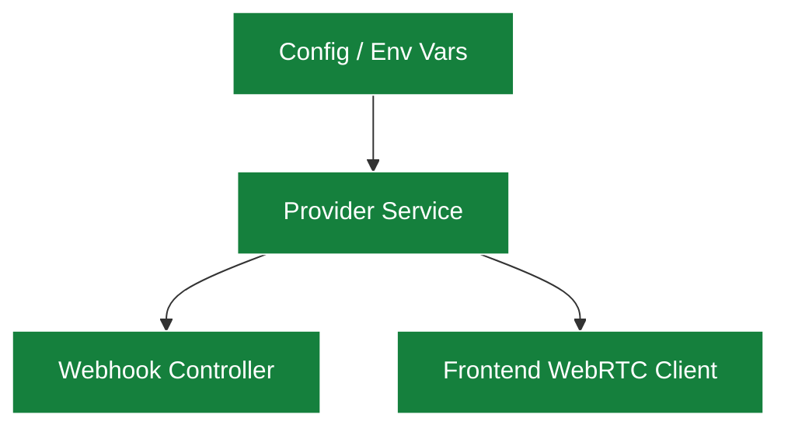

Ringee's telephony layer is designed to be **provider-agnostic**. This guide walks you through adding a new telephony provider.

## Requirements

Before adding a new provider, ensure the service supports:

- **WebRTC** for browser-based calling
- **REST API** for call management (create, hangup, transfer, etc.)
- **Phone number provisioning** via API
- **Webhook callbacks** for call events (ringing, answered, ended)
- **Call recording** (optional but recommended)

## Architecture

A telephony provider in Ringee consists of the following components:

### 1. Provider Service (Backend)

Create a new service in the backend that implements the core telephony operations:

- **Make a call** — Initiate an outbound call
- **Receive a call** — Handle an inbound call via webhooks
- **End a call** — Hang up an active call
- **Record a call** — Start/stop recording
- **Buy a number** — Purchase a phone number
- **List available numbers** — Search for available phone numbers by country

### 2. Webhook Controller

Create a controller to handle incoming webhook events from the provider:

- **Call initiated** — A call has started
- **Call answered** — The recipient picked up
- **Call ended** — The call has been terminated
- **Recording ready** — A call recording is available for download

### 3. Frontend WebRTC Client

Integrate the provider's WebRTC SDK in the frontend to handle browser-based calling:

- Initialize the WebRTC connection
- Handle microphone access
- Display call state (ringing, connected, ended)

### 4. Configuration

Add the required environment variables for the new provider to the `.env.example` file and document them.

## Steps

<Steps>
<Step title="Create the provider service">

Add a new service module in the backend with the core telephony operations listed above.

</Step>

<Step title="Add webhook handlers">

Create webhook endpoint(s) to receive call events from the provider.

</Step>

<Step title="Integrate the WebRTC SDK">

Add the provider's WebRTC client library to the frontend and wire it into the call UI.

</Step>

<Step title="Add environment variables">

Define all required API keys and configuration variables in `.env.example`.

</Step>

<Step title="Write documentation">

Add a new page in `docs/providers/your-provider.mdx` with setup instructions, and update `docs.json` to include it in the navigation.

</Step>

<Step title="Submit a PR">

Open a pull request with your changes. Make sure to include tests and documentation.

</Step>
</Steps>

<Info>
We welcome contributions! If you're adding a new provider, feel free to open an issue first to discuss the integration approach.
</Info>
