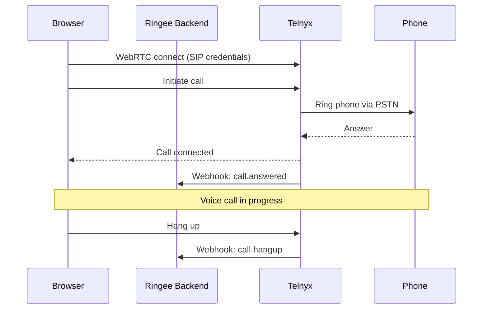

[Telnyx](https://telnyx.com) is Ringee's default and recommended telephony provider. It provides WebRTC-based calling, phone number management, and call recording through a powerful API.

## Setup

<Steps>
<Step title="Create a Telnyx account">

Go to [telnyx.com](https://telnyx.com) and sign up for an account.

</Step>

<Step title="Get your API key">

1. In the Telnyx portal, go to **API Keys**
2. Copy your **API Key** (starts with `KEY...`)

</Step>

<Step title="Create a Credential Connection (WebRTC)">

Ringee uses Telnyx's **Credential Connections** for WebRTC calling:

1. Go to **Voice** → **Connections** → **Credential Connections**
2. Click **Add Credential Connection**
3. Configure the connection:
   - **Connection Name**: `ringee-webrtc`
   - **Username**: Choose a SIP username
   - **Password**: Choose a SIP password
4. Copy the **Connection ID**, **Username**, and **Password**

</Step>

<Step title="Buy a phone number">

1. Go to **Numbers** → **Search & Buy**
2. Search for a number in your desired country
3. Purchase the number
4. Assign the number to your credential connection

</Step>

<Step title="Configure webhooks">

Set up webhooks to receive call events:

1. Go to your credential connection settings
2. Set the **Webhook URL** to: `https://your-backend-url/api/telnyx/webhook`
3. Events will be sent for: call initiated, answered, ended, recording completed, etc.

</Step>

<Step title="Configure environment variables">

Add the following to your `.env` file:

```env
TELNYX_API_KEY="KEYyour_api_key_here"
TELNYX_CONNECTION_ID="your_connection_id"
TELNYX_SIP_USER="your_sip_username"
TELNYX_SIP_PASSWORD="your_sip_password"
NEXT_PUBLIC_TELNYX_LOGIN="your_sip_username"
NEXT_PUBLIC_TELNYX_PASSWORD="your_sip_password"
```

</Step>
</Steps>

## Environment Variables

| Variable | Required | Description |
|---|---|---|
| `TELNYX_API_KEY` | Yes | Your Telnyx API key |
| `TELNYX_CONNECTION_ID` | Yes | Credential connection ID for WebRTC |
| `TELNYX_SIP_USER` | Yes | SIP username for the credential connection |
| `TELNYX_SIP_PASSWORD` | Yes | SIP password for the credential connection |
| `NEXT_PUBLIC_TELNYX_LOGIN` | Yes | SIP login exposed to the frontend (same as `TELNYX_SIP_USER`) |
| `NEXT_PUBLIC_TELNYX_PASSWORD` | Yes | SIP password exposed to the frontend (same as `TELNYX_SIP_PASSWORD`) |

<Note>
The `NEXT_PUBLIC_` variables are needed by the frontend to establish WebRTC connections directly from the browser to Telnyx. These are the same values as the SIP credentials.
</Note>

## How it works



## Features

| Feature | Supported |
|---|---|
| Outbound calls | ✅ |
| Inbound calls | ✅ |
| Call recording | ✅ |
| Phone number purchase | ✅ |
| Number search by country | ✅ |
| WebRTC (browser calling) | ✅ |
| Call transfer | ✅ |

## Troubleshooting

<AccordionGroup>
  <Accordion title="Calls not connecting">
    Verify that your SIP credentials match between `TELNYX_SIP_USER` / `TELNYX_SIP_PASSWORD` and `NEXT_PUBLIC_TELNYX_LOGIN` / `NEXT_PUBLIC_TELNYX_PASSWORD`. Also ensure your credential connection is active in the Telnyx portal.
  </Accordion>

  <Accordion title="Webhooks not received">
    Make sure your webhook URL is publicly accessible. For local development, use a tunneling service like [ngrok](https://ngrok.com) to expose your backend: `ngrok http 3000`
  </Accordion>

  <Accordion title="No phone numbers available">
    Phone number availability varies by country. Try searching for different area codes or number types (local vs. toll-free).
  </Accordion>
</AccordionGroup>
