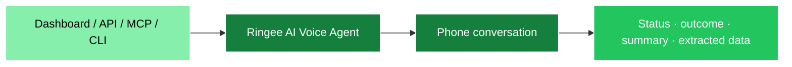

AI Voice Agents place outbound calls, speak with the person who answers and return a structured result. A call can book a meeting, confirm an appointment, deliver an update, request human follow-up and extract fields from the conversation.

<CardGroup cols={2}>
  <Card
    title="Create your first agent"
    icon="rocket"
    href="/voice-agents/quickstart"
  >
    Configure, test and place a call
  </Card>
  <Card
    title="Automate agent calls"
    icon="code"
    href="/voice-agents/api-reference"
  >
    Use the Public API, MCP or CLI
  </Card>
</CardGroup>

## What an agent does



Every trigger surface reaches the same service. Workspace ownership, agent readiness, Do Not Call checks, calling permissions, available credits and caller-number eligibility are enforced in one place.

## Agent types

| Type                      | Best for                                         | Built-in behavior                                                                                                |
| ------------------------- | ------------------------------------------------ | ---------------------------------------------------------------------------------------------------------------- |
| `appointment_booking`     | Sales qualification and meeting booking          | Reads live calendar availability, confirms a specific slot and creates the meeting only after explicit agreement |
| `reminders_notifications` | Appointment confirmations, reminders and updates | Delivers the supplied information, records whether the person confirmed and requests human follow-up when needed |

See [Configuration](/voice-agents/configuration) for each type's variables and outcomes.

## Availability

AI Voice Agents require an **active organization workspace**. They are not available in a personal workspace. The dashboard, Public API, MCP and CLI all enforce this rule.

Operations that depend on another Ringee capability still follow that capability's rules. For example, the selected caller number and calendar must belong to the active workspace.

## What comes back

Starting a call returns immediately with an AI voice agent call id. The conversation runs asynchronously. Poll the result until its telephony status is terminal and post-call analysis has arrived.

```json
{
  "call_id": "8ddf384a-9b9d-44dd-a120-23395b1f4c98",
  "status": "completed",
  "outcome": "appointment_booked",
  "summary": "Carlos agreed to a product demo on Friday at 10:30 AM.",
  "sentiment": "positive",
  "extracted_data": {
    "budget_range": "$5k-$10k"
  },
  "metadata": {
    "external_id": "crm-contact-42"
  }
}
```

The corresponding call also appears in Ringee call history. Ringee recovers its recording and the transcript produced during the live conversation when the provider makes them available.

## Ways to use it

| Surface                                   | Use it when                                                                          |
| ----------------------------------------- | ------------------------------------------------------------------------------------ |
| Dashboard                                 | A person is creating, tuning, testing or manually triggering an agent                |
| [Public API](/voice-agents/api-reference) | Your server should list agents, start calls and read results with a `cik_live_…` key |
| [MCP](/voice-agents/mcp)                  | Claude, ChatGPT or another MCP client should select an agent and start a call        |
| [CLI](/voice-agents/cli)                  | A script or shell-capable agent should list agents, call and read results            |

<Note>
  The Public API exposes the execution flow: list agents and caller numbers,
  start calls, and read results. Create and configure agents in the dashboard.
</Note>

## Next steps

<CardGroup cols={2}>
  <Card title="Quickstart" icon="rocket" href="/voice-agents/quickstart">
    Create, test and call with an agent
  </Card>
  <Card title="Calls and results" icon="phone" href="/voice-agents/calls">
    Understand gates, status and billing
  </Card>
</CardGroup>
